<p align="center">
  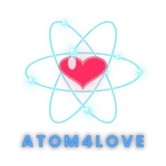
</p>

<h1 align="center">Atom4Love</h1>

<p align="center">
  <strong>Client Android natif pour la rencontre de proximité<br />
  sans serveur central, sans biométrie et sans traçage de position.</strong>
</p>

<p align="center">
  <a href="https://www.gnu.org/licenses/agpl-3.0"></a>
  <a href="https://kotlinlang.org/"></a>
  <a href="https://github.com/FlorentLefevre-lab/Atom4Love/releases/latest"></a>
  
</p>

---

## Par quoi les gens se rencontrent ici

Il n'y a pas de profil à remplir, pas de photo, pas de préférences à cocher et aucun
algorithme de recommandation. Ce qu'Atom4Love compare, c'est **l'instant et le lieu de la
naissance** — l'éphéméride : où la Terre se trouvait sur son orbite, où elle en était de sa
rotation, et sous quel point du globe. De là sortent deux grandeurs, et rien d'autre ne
circule.

**L'onde — la phase personnelle φ.** L'instant de naissance donne un angle, à la minute et
au degré près : l'angle annuel de l'orbite, l'angle du jour, et le décalage du lieu sur une
grille pentagonale qui tourne en 14,83 h. Deux personnes qui se croisent croisent deux ondes,
et leur accord se lit dans un seul nombre, **`k`**, entre 0,5 et 1. Il monte quand les deux
ondes sont en phase — **ou exactement en opposition**, ce qui revient à se répondre : un
aimant trouve son pôle contraire. Ce qui ne dit rien, c'est le quart de tour, entre les deux.
Aucun de ces calculs ne demande le réseau : les deux appareils trouvent le même `k`, chacun
de son côté, à partir de ce que porte déjà l'annonce **BLE** — *Bluetooth Low Energy*, la
diffusion sans connexion et sans appairage par laquelle deux appareils se signalent l'un à
l'autre à quelques mètres.

**Le sceau — le compte galactique du Tzolkin.** Le Tzolkin est le compte maya de 260 jours :
vingt sceaux, qui sont des archétypes, croisés de treize tons, qui sont des niveaux
d'énergie. Une date de naissance tombe sur l'une des 260 cases — c'est le **KIN**, ce que le
vocabulaire du calendrier appelle une signature galactique. Autour de lui, l'Oracle en
désigne quatre autres : le **guide**, le **défi**, l'**alternance** et l'**occulte**. Ce sont
quatre façons de se compléter, jamais un contraire — un défi ne vaut pas moins qu'une union.

**Ce qui en sort, et ce qui n'en sort pas.** Un plan qui s'aligne fait un
$\color{orange}{\textsf{\textbf{match}}}$ : `k` au-delà de 0,90, ou un sceau de votre Oracle en
face — une personne croisée sur six. Les deux ensemble font un
$\color{red}{\textsf{\textbf{super match}}}$, `k` passant alors 0,95 : trois rencontres sur
mille. Ces deux seuils viennent de Fred et ont été mesurés sur 79 800 paires. Il n'y a rien d'autre :
pas de note, pas de classement, pas de file de suggestions, et **personne n'apprend qu'on
l'a vu**. La réciprocité existe, mais elle est physique — deux écrans qui battent le même
rythme dans une salle, chacun l'ayant calculé seul.

> Les formules sont celles de Fred R. / G1FabLab, publiées en **D1** (phase personnelle) et
> **D4** (matrices d'oracle Tzolkin) — voir « Fondations techniques ». Le modèle s'appuie sur
> des correspondances symboliques transposées en calculs déterministes : c'est un choix de
> conception assumé, pas une théorie physique. Voir « Ce que ce n'est pas ».

---

## Le parcours

La barre du bas ne compte que trois entrées : **Carte**, **Plateau**, **Noyau** — ce qui est
dehors, le jeu, et soi. Les maquettes d'origine en prévoyaient six ; trois ont quitté la barre,
chacune pour une raison différente. L'**Aide** et les **Réglages** sont devenus deux boutons
dans la ligne du haut : on les ouvre et on les referme, on n'y « revient » pas, et un onglet
promet un lieu où l'on revient. Le **Radar** et la **Constellation**, eux, n'étaient pas deux
endroits mais deux façons de regarder les autres — de près par la radio, ou à l'échelle du monde
par le relais ; ils sont réunis dans l'onglet Carte, où un sélecteur bascule entre *Ici* et *Le
monde*. Le **Plateau** garde sa place au milieu, mais reste éteint tant qu'aucun sceau n'est à
portée.

<table>
  <tr>
    <td width="33%" valign="top">
      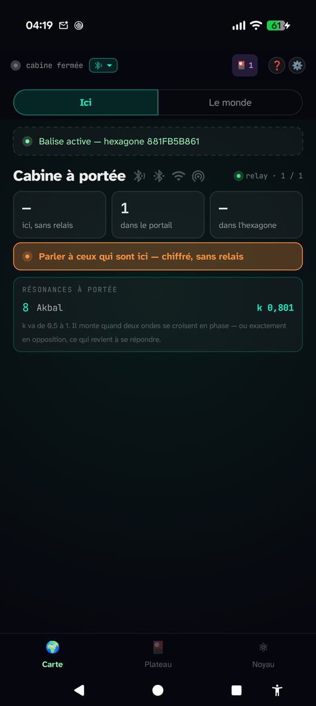<br />
      <b>🌍 Carte · Ici</b><br />
      Ce qui est à portée d'antenne : la cellule qu'on diffuse, le nombre de noyaux dans le
      portail, et la résonance de chacun — un sceau et un <code>k</code>, jamais un nom.
    </td>
    <td width="33%" valign="top">
      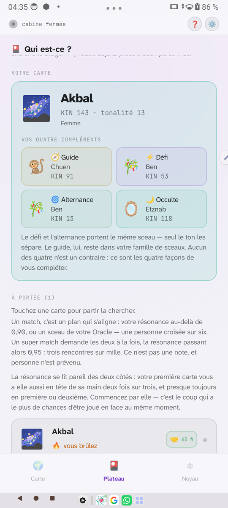<br />
      <b>🎴 Plateau</b> — <i>en lumière de jour</i><br />
      Le tirage : votre carte et ses quatre compléments, puis les cartes à portée avec leur
      chaleur. « Cherche le Dragon » réduit une salle de trente à deux personnes.
    </td>
    <td width="33%" valign="top">
      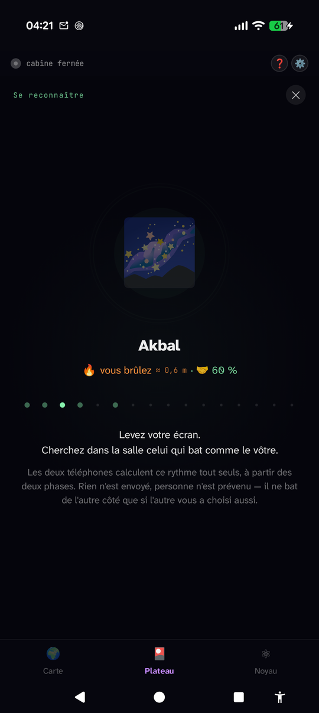<br />
      <b>🔦 Rendez-vous</b><br />
      La lanterne bat un rythme que l'autre téléphone calcule tout seul, à partir des deux φ
      déjà dans l'air. Rien de plus n'est émis ; le dernier mètre est franchi par les yeux.
    </td>
  </tr>
  <tr>
    <td valign="top">
      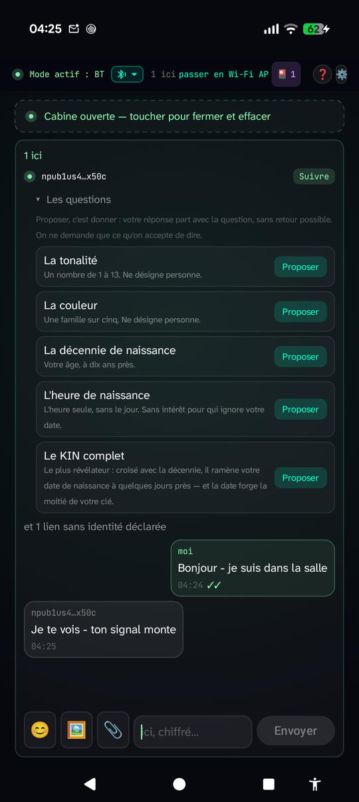<br />
      <b>💬 Cabine</b><br />
      Le canal chiffré et attesté (Noise), ici porté par le Bluetooth classique. Les questions
      s'y échangent selon une seule règle : proposer, c'est donner.
    </td>
    <td valign="top">
      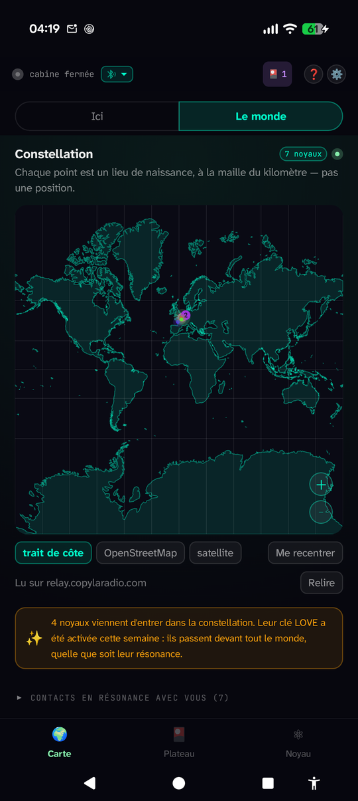<br />
      <b>🌍 Carte · Le monde</b><br />
      La constellation des noyaux dont la station a scellé la clé LOVE, chacun à son
      <b>lieu de naissance</b> au kilomètre — jamais là où il se trouve.
    </td>
    <td valign="top">
      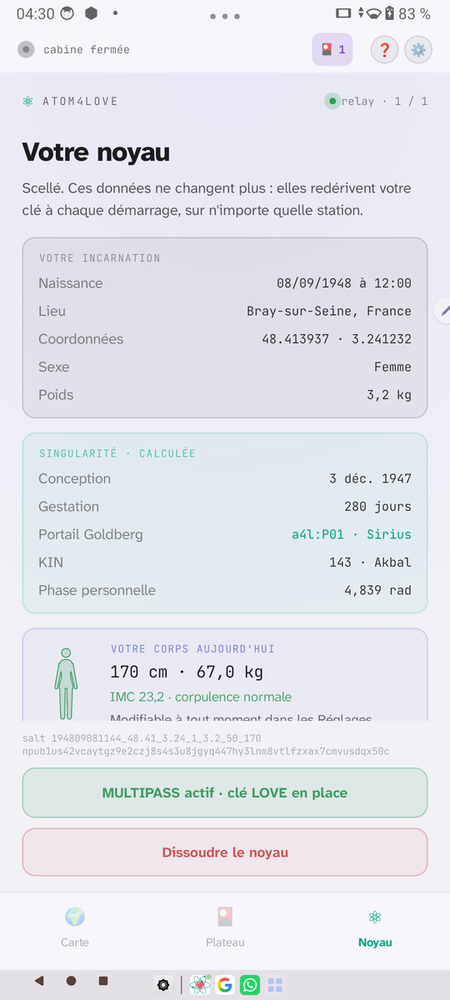<br />
      <b>⚛ Noyau</b> — <i>en lumière de jour</i><br />
      La fiche scellée et ce qu'elle calcule : conception, portail, KIN, phase. Rien n'en part.
      La dissolution efface tout, derrière une double confirmation.
    </td>
  </tr>
</table>

<p><i>Les vignettes sont réduites pour tenir en une grille. Pour lire un écran en pleine
taille <b>sans quitter cette page</b>, ouvrez-le ici — cliquer la vignette, elle, emmène sur
la page du fichier.</i></p>

<details>
  <summary>🔍 &nbsp;<b>Carte · Ici</b></summary>
  <p></p>
</details>
<details>
  <summary>🔍 &nbsp;<b>Plateau</b></summary>
  <p></p>
</details>
<details>
  <summary>🔍 &nbsp;<b>Rendez-vous</b></summary>
  <p></p>
</details>
<details>
  <summary>🔍 &nbsp;<b>Cabine</b></summary>
  <p></p>
</details>
<details>
  <summary>🔍 &nbsp;<b>Carte · Le monde</b></summary>
  <p></p>
</details>
<details>
  <summary>🔍 &nbsp;<b>Noyau</b></summary>
  <p></p>
</details>

<details>
  <summary>Le splash, les Réglages, l'Aide — et les maquettes d'origine</summary>

  <table>
    <tr>
      <td width="33%" valign="top">
        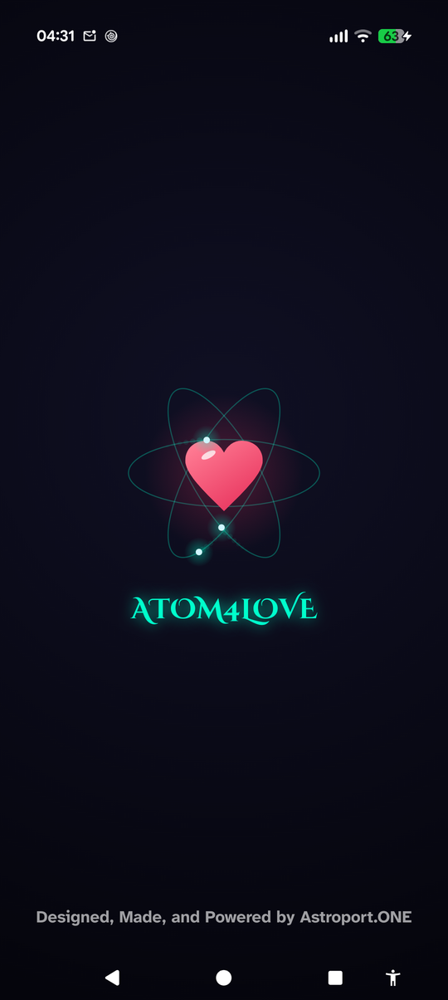<br />
        L'atome au lancement.
      </td>
      <td width="33%" valign="top">
        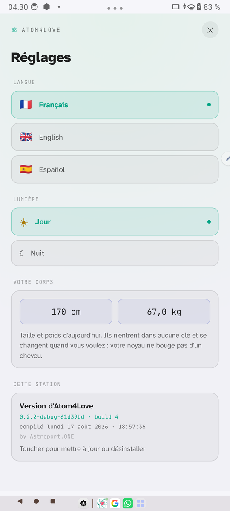<br />
        Trois langues, deux lumières, le corps du jour — et la bulle de version, d'où partent
        la mise à jour et la désinstallation.
      </td>
      <td width="33%" valign="top">
        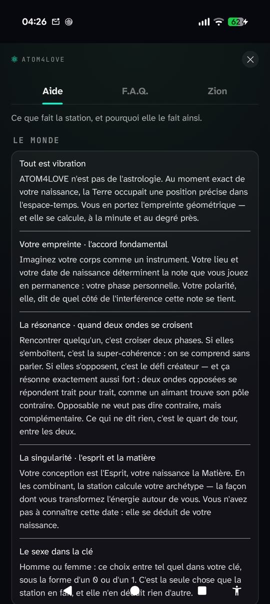<br />
        L'Aide, la F.A.Q. et Zion : ce que fait la station, et pourquoi elle le fait ainsi.
      </td>
    </tr>
  </table>

  <br />

  <p>
    <b>Les maquettes d'origine (juin 2026).</b> Elles décrivent le parcours <b>visé au
    départ</b>, à six onglets, avant que la cabine, le jeu en trois coups et le MULTIPASS
    n'existent. Gardées pour l'histoire ; l'application ne leur ressemble plus.
  </p>

  <p align="center">
    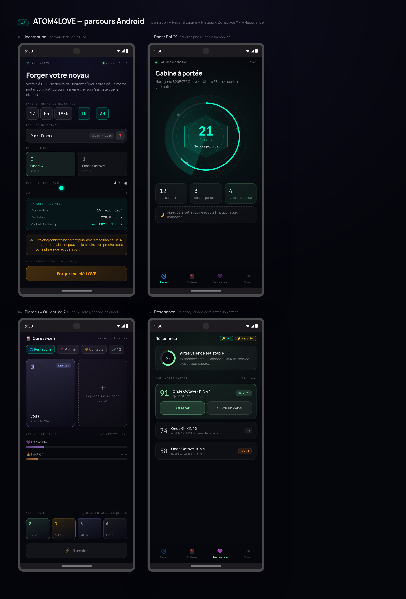
  </p>
</details>

> Captures prises le 18 août 2026 sur deux appareils réels (Pixel 10 Pro en lumière de nuit,
> tablette en lumière de jour), version `0.2.2`. Les deux noyaux se voyaient l'un l'autre en
> BLE : le voisin, la carte à portée et la conversation chiffrée sont ceux d'un vrai croisement,
> pas une mise en scène. Le **MULTIPASS** n'est pas montré : son écran porte un code PASS.

---

## État du projet

**Stade : alpha publiée — v0.2.2 (versionCode 4, 17 août 2026).** L'application s'installe,
se met à jour toute seule, et le parcours complet a été éprouvé sur appareils réels : forger
son noyau, dériver ses clés, se voir apparaître sur le radar de l'autre, ouvrir une cabine
chiffrée et s'y parler. La détection de proximité et la cabine ont été **validées en croisé
sur deux téléphones**, dans les deux sens.

Ce n'est pas encore une bêta : rien n'est promis sur la stabilité, la rotation D2 n'est pas
arrêtée, et la confiance au premier contact reste à durcir.

### Ce qui fonctionne aujourd'hui

- **Forge du noyau** — date, heure (facultative), lieu et onde ; autocomplétion des communes,
  récapitulatif avant validation, persistance locale, dissolution complète.
  ⚠ La précision des coordonnées fait partie de la clé : elles s'affichent et se saisissent
  entières, sinon la même fiche rouvre une autre clé.
- **Clés déterministes** — la chaîne complète PBKDF2 → scrypt → SHA-256 → secp256k1, portée
  en Kotlin depuis les outils de la station et **vérifiée octet pour octet** contre elle sur
  un MULTIPASS réel.
- **NOSTR, en lecture et en écriture** — relais déduit de l'hôte, comme chez Fred. L'app
  publie son certificat ATOM4LOVE (kind 30078, `d=atom4love`) sur un geste explicite et
  irréversible qui montre d'abord exactement ce qui partira ; elle tient un carnet NIP-02
  (kind 3) alimenté par les rencontres attestées, écoute les accueils, et porte un salon de
  cabine (kind 24242).
- **MULTIPASS** — demande d'inscription depuis l'app, redérivation de la clé LOVE après une
  reforge. Tout le reste (portefeuilles, uDRIVE) reste l'ouvrage de la station.
- **Adressage géographique** — cellule H3 calculée depuis la position, portail Goldberg dérivé
  du lieu de naissance. Aucune coordonnée ne quitte l'appareil, et la localisation ne passe
  jamais par les services Google.
- **Proximité BLE continue** — annonce de 17 octets (adresse 4D, jeton de présence, polarité,
  sceau maya, phase), scan en tâche de fond, registre des voisins. Portée mesurée : **7 m**.
  La balise ne s'annonce que si la localisation est accordée, et se tait pendant les
  transferts.
- **Le jeu en trois coups** — tirage (Plateau), reconnaissance (lanterne), questions (cabine).
  $\color{orange}{\textsf{\textbf{Match}}}$ et
  $\color{red}{\textsf{\textbf{super match}}}$ sur les seuils de Fred, calibrés sur 79 800
  paires. Rien n'est classé, rien n'est noté, et personne n'apprend qu'on l'a choisi.
- **Cabine chiffrée** — Noise, **entièrement porté en Kotlin** (29 fichiers, vérifiés octet
  pour octet contre l'implémentation Java de référence et en cabine réelle Kotlin ↔ Java).
  Quatre médiums, avec escalade sur échec : BLE (la seule porte, la seule qui découvre et
  atteste), Bluetooth classique RFCOMM (78–102 ko/s), Wi-Fi du lieu, Wi-Fi Direct (15,5 Mo/s).
  Pièces jointes, vidéo à sa qualité d'origine, tout effacé en sortant.
- **Mise à jour intégrée** — l'app lit un manifeste, télécharge l'APK, **vérifie son
  empreinte SHA-256** et passe la main à l'installeur du système. La désinstallation part du
  même endroit.
- **Habillage** — thème jour et nuit, trois langues (français, anglais, espagnol), Material 3,
  typographies embarquées, splash animé.
- **45 fichiers de tests** JVM et instrumentés, dont un test différentiel qui compare le
  portage Noise à sa référence.

### Ce qui reste ouvert

- **Rotation temporelle D2** — la v0 diffuse l'index H3 statique, sans rotation
  (`CellRotation.None`). Assumé tant que la formule n'est pas arrêtée : la portée BLE mesurée
  (7 m) borne l'information révélée à des appareils déjà dans la même pièce.
- **Confiance au premier contact** — la cabine chiffre et atteste, mais rien ne protège encore
  contre un inconnu qui se présenterait pour un autre à la toute première rencontre.
- **Synthèse sonore collective (D5)** — retirée du dépôt le 15 août 2026, concept entier. Elle
  n'est pas implémentée et n'est pas en chantier.
- **Miroir de distribution** — l'APK est sur GitHub ; le miroir de la station attend Fred
  (voir [`docs/note-distribution-apk.md`](docs/note-distribution-apk.md)).
- **TLS sous Android 10** — le relais et le MULTIPASS de la station ne présentent qu'une
  courbe P-384, qu'aucun Android antérieur à 10 n'accepte. Rien à corriger côté application
  ([`docs/note-courbe-p384.md`](docs/note-courbe-p384.md)).
- **Portage iOS** — l'étude est faite et l'arborescence est déjà nommée pour un projet
  multiplateforme, mais le sujet est mis de côté
  ([`docs/note-portage-ios.md`](docs/note-portage-ios.md)).

Les décisions d'architecture les plus structurantes (rotation D2, premier contact) sont
encore ouvertes : c'est le bon moment pour peser sur elles.

---

## Installer

L'APK est signé (schémas v2 et v3) et publié sur GitHub :

```
https://github.com/FlorentLefevre-lab/Atom4Love/releases/latest/download/atom4love-latest.apk
```

Cette adresse ne nomme aucune version : elle sert toujours la dernière. Le manifeste
[`latest.json`](latest.json) porte le numéro, la taille, la date et l'empreinte SHA-256 —
c'est lui que l'application lit pour savoir qu'elle est en retard, et c'est cette empreinte
qu'elle vérifie avant de proposer l'installation.

Une fois la première version installée, les suivantes se prennent depuis l'application, par
la bulle de version au bas des Réglages.

> **Play Protect.** Android prévient qu'il ne connaît pas l'éditeur : c'est le comportement
> normal pour une application hors magasin. La distribution de référence se fera par
> [F-Droid](https://f-droid.org/) et par APK signé — l'AGPL s'accorde mal avec les conditions
> du Play Store.

---

## De quoi s'agit-il ?

Atom4Love est une application Android qui met en relation des personnes géographiquement
proches, en s'appuyant sur l'infrastructure décentralisée
[Astroport.ONE](https://github.com/papiche/Astroport.ONE) (NOSTR + IPFS + Ğ1).

Trois mécanismes la distinguent d'une application de rencontre classique :

**Identité déterministe.** L'identité de l'utilisateur est dérivée de paramètres personnels
stables, jamais de données biométriques ni d'un compte hébergé chez un tiers. Aucun serveur
ne détient de profil.

**Adressage géographique opaque.** L'application ne transmet jamais de coordonnées GPS.
Elle publie l'identifiant d'une cellule hexagonale issue d'un pavage planétaire, destiné à
être soumis à une rotation temporelle : le même identifiant ne désignerait plus le même lieu
physique d'un instant à l'autre. C'est ce que la spécification appelle une adresse 4D — la
formule de rotation est le point encore ouvert (voir « État du projet »).

**La rencontre est l'authentification.** Il n'y a pas de messagerie ouverte : on se tire
d'abord dessus une carte, on se reconnaît ensuite des yeux dans la salle, et la cabine
chiffrée ne s'ouvre qu'après — jamais pour découvrir quelqu'un. Le jeu ne révèle aucune
identité ; il permet de devenir trouvable.

### Ce que ce n'est pas

- Pas de serveur central, pas de base de données de profils, pas de compte à créer.
- Pas de biométrie, pas de reconnaissance faciale, pas d'empreinte.
- Pas d'algorithme de classement propriétaire : la logique de mise en relation est dans ce
  dépôt, lisible et modifiable.
- Pas de score et pas de réciprocité serveur : deux téléphones qui battent le même rythme
  dans une salle se constatent avec les yeux, rien ne circule pour le dire.
- **Pas un projet à prétention scientifique.** Le modèle de résonance de D1 et D4 s'appuie
  sur des correspondances symboliques (éphémérides de naissance, calendrier Tzolkin)
  transposées en calculs déterministes et reproductibles. C'est un choix de conception assumé,
  pas une théorie physique. Le code, lui, se juge sur des critères ordinaires : déterminisme,
  couverture de tests, absence de fuite de données.

---

## Pile technique

| Couche | Choix |
|---|---|
| Langage | Kotlin 2.2 |
| Interface | Jetpack Compose (Material 3), mises en page adaptatives, thème jour/nuit, fr/en/es |
| Architecture | Hilt, Room, DataStore, WorkManager, OkHttp |
| Cryptographie | [secp256k1-kmp](https://github.com/ACINQ/secp256k1-kmp) (ACINQ) ; scrypt et PBKDF2 pour la dérivation de la clé LOVE |
| Cabine chiffrée | [Noise Protocol](https://noiseprotocol.org/) — portage Kotlin intégral de `noise-java`, testé en différentiel contre sa référence |
| Messagerie | NOSTR — NIP-01, NIP-02 (carnet), NIP-09, NIP-19, NIP-42, NIP-78 (kind 30078 `d=atom4love`) |
| Géographie | [H3](https://h3geo.org/) 4.4.0 (Uber) pour le pavage hexagonal statique — AAR local patché, l'artefact amont omet `libm` |
| Proximité | BLE advertising + scan (annonce de 17 octets, service continu), RFCOMM, Wi-Fi Direct, sockets TCP encadrés |
| Média | Media3 (vidéo de la cabine, jamais ré-encodée), Coil |
| Typographie | [Atkinson Hyperlegible Next](https://fonts.google.com/specimen/Atkinson+Hyperlegible+Next) (texte — dessinée pour la basse vision), [JetBrains Mono](https://fonts.google.com/specimen/JetBrains+Mono) (données, adresses, compteurs) et [Cinzel Decorative](https://fonts.google.com/specimen/Cinzel+Decorative) (le nom, sur le splash) — embarquées, SIL OFL 1.1, textes dans `licenses/` |
| Build | Gradle KTS 9.5, AGP 9.3.1, module unique `:composeApp` — minSdk 26, targetSdk 36, JDK 17. Arborescence déjà nommée comme un projet multiplateforme (`commonMain`, `androidMain`, `iosMain`), Android seul compilé — voir `docs/note-portage-ios.md` |

> **Note d'implémentation.** H3 fournit le pavage hexagonal de référence ; la couche de
> rotation temporelle décrite en D2 s'applique par-dessus, à l'encodage et au décodage
> (interface `CellRotation`, actuellement en v0 identité). C'est le point d'architecture le
> plus délicat du projet et il est encore ouvert à la discussion.

---

## Démarrage

```bash
git clone https://github.com/FlorentLefevre-lab/Atom4Love.git
cd Atom4Love
./gradlew assembleDebug
```

Prérequis : JDK 17+, Android SDK. Aucune clé d'API, aucun compte, aucune configuration à
fournir : les clés sont dérivées localement des paramètres de naissance saisis au premier
lancement.

Pour voir la proximité fonctionner, il faut **deux appareils physiques** avec le Bluetooth
activé : chacun diffuse son adresse de cellule et voit l'autre apparaître sur le radar. Une
cabine en demande deux aussi, et **la même version des deux côtés** — trois numéros différents
donnent une cabine muette, sans la moindre erreur au journal. L'émulateur suffit pour tout le
reste (forge, clés, radar sans voisins).

> ⚠ Les tests instrumentés (`connectedAndroidTest`) désinstallent l'application et effacent
> le noyau scellé de l'appareil. Notez les cinq données de la fiche avant de les lancer.

---

## Fondations techniques

Les algorithmes fondateurs ont fait l'objet de cinq publications défensives sur
[TDCommons](https://www.tdcommons.org/) (juin 2026, G1FabLab).

Ces dépôts établissent une **antériorité opposable** : ils versent les mécanismes décrits
dans l'état de l'art afin qu'ils ne puissent pas être ultérieurement appropriés par un dépôt
de brevet. TDCommons est une plateforme de publication défensive en libre soumission — ce ne
sont **pas** des publications à comité de lecture, et elles ne confèrent aucun droit exclusif.
C'est exactement l'intention recherchée.

| | Publication |
|---|---|
| **D1** | [Deterministic Personal Phase Computation from Birth Ephemeris Data for Social Resonance Matching](https://www.tdcommons.org/dpubs_series/10326) |
| **D2** | [4D Opaque Hexagonal Geo-Addressing Scheme Using Dynamic Goldberg Polyhedra](https://www.tdcommons.org/dpubs_series/10327) |
| **D3** | [Biometric Birth Ephemeris as Deterministic Parameters for Shamir Secret Sharing Key Recovery](https://www.tdcommons.org/dpubs_series/10328) |
| **D4** | [Tzolkin Kin-Based Oracle Matrices Combined with Phase Interference Metrics](https://www.tdcommons.org/dpubs_series/10329) |
| **D5** | [Decentralized Additive Synthesis Orchestra Governed by Biometric Phase Fields](https://www.tdcommons.org/dpubs_series/10330) |

Atom4Love implémente **D1, D2 et D4**. D5 a été retiré du dépôt le 15 août 2026 ; D3 n'a pas
été abordé.

---

## Projets connexes

### Écosystème UPlanet / G1FabLab (Fred R.)

- **[Astroport.ONE](https://github.com/papiche/Astroport.ONE)** — la station décentralisée
  (NOSTR, IPFS, Duniter/Ğ1, MULTIPASS). AGPL-3.0. Atom4Love en est un client : il dialogue
  avec elle par API et par NOSTR, sans en être une œuvre dérivée.
- **[UPassport](https://github.com/papiche/UPassport)** — API terminal (FastAPI) pour
  l'identité et le stockage uDRIVE, authentification NOSTR NIP-42.
- **[UPlanet](https://github.com/papiche/UPlanet)** — la grille géographique et sa
  visualisation ; c'est aussi là que vit le miroir de l'APK, dans `earth/apk/`.
- **[cabine-33](https://github.com/papiche/cabine-33)** — implémentation Godot des mêmes
  algorithmes (phase personnelle, adressage hexagonal opaque, orchestre). Référence utile
  pour comparer les comportements attendus.
- **[G1FabLab sur Open Collective](https://opencollective.com/monnaie-libre)** — financement
  et actualités de l'écosystème.

### Briques amont

- [secp256k1-kmp](https://github.com/ACINQ/secp256k1-kmp) — ACINQ, courbes elliptiques
  multiplateformes.
- [noise-java](https://github.com/rweather/noise-java) — Southern Storm Software, implémentation de
  référence du Noise Protocol, portée en Kotlin dans ce dépôt.
- [H3](https://github.com/uber/h3) — Uber, indexation hexagonale.
- [NIPs NOSTR](https://github.com/nostr-protocol/nips) — spécifications du protocole.

---

## Contribuer

Les contributions sont bienvenues, y compris de la part de personnes qui découvrent NOSTR ou
Compose. Voir [CONTRIBUTING.md](CONTRIBUTING.md) pour le détail.

**Signature des commits.** Le projet utilise le [Developer Certificate of
Origin](https://developercertificate.org/). Signez vos commits avec `git commit -s`, ce qui
ajoute une ligne `Signed-off-by`. Il n'y a pas de CLA : personne ne collecte vos droits, le
code restera sous AGPL-3.0.

**Par où commencer.** Les tickets étiquetés `good first issue` sont conçus pour être
réalisables sans connaître l'ensemble du système.

<!-- À COMPLÉTER : ouvrir 5 ou 6 tickets réellement autonomes avant de diffuser ce README.
     Un dépôt sans tickets ouverts ne convertit personne. Exemples de bons candidats :
     caractérisation de la portée RSSI, tests unitaires sur l'encodeur H3, relecture des
     traductions es/en, accessibilité du Plateau. -->

**Discussion.** : Salons dédiés sur WhatsApp et Telegram ...

---

## Licence

Ce projet est distribué sous licence **GNU Affero General Public License v3.0**
(voir [`LICENSE`](LICENSE)).

Concrètement : vous pouvez utiliser, étudier, modifier et redistribuer ce code. Si vous le
modifiez et le proposez comme service accessible par le réseau, vous devez publier vos
modifications sous la même licence. Il n'y aura jamais de version propriétaire d'Atom4Love,
ni de double licence.

Ce choix aligne le projet sur Astroport.ONE, également en AGPL-3.0.

---

## Crédits

Développement Android : Florent Lefèvre.
Algorithmes fondateurs et écosystème : Fred R. / [G1FabLab](https://opencollective.com/monnaie-libre).
Portage Noise : d'après `noise-java` (Southern Storm Software, MIT) — en-têtes de copyright conservés dans chaque fichier.
Typographies : *Atkinson Hyperlegible Next* (Braille Institute of America), *JetBrains
Mono* (JetBrains) et *Cinzel Decorative* (Natanael Gama) — toutes trois sous SIL Open
Font License 1.1.
